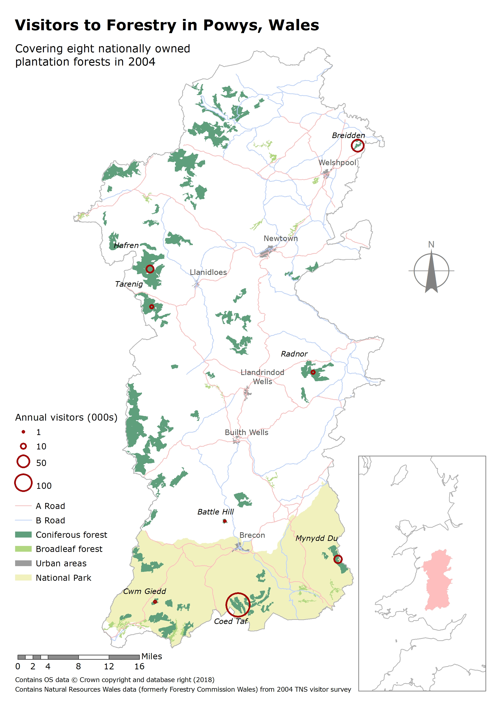
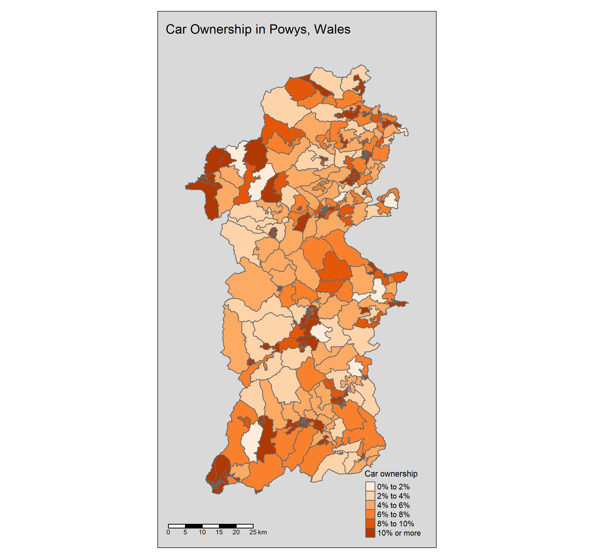

TEXT TEXT TEXT 


```{r}
library(maptools) 
library(RColorBrewer) 
library(sp) 
library(rgeos) 
library(tmap) 
library(tmaptools) 
library(sf) 
library(rgdal)
#Reading the Shapefile for the entirety of England and Wales
EngWal.OA <- read_shape("OAEngWal/Output_Area_December_2011_Generalised_Clipped_Boundaries_in_England_and_Wales.shp", as.sf = T)
#Selecting just Powys OAs with tag "W06000023"
powys.OA <- EngWal.OA[grep("^W06000023", EngWal.OA$lad11cd),]
#Import census data
carownership <- read.csv("KS404EWDATA.CSV", header = T, sep = ",")
#Joining census data
powys.OA.datamap <- append_data(powys.OA, carownership, key.shp = "oa11cd", key.data = "GeographyCode", ignore.duplicates = T)
#Simplifying the the car/van ownership column reference
own <- "KS404EW0008"
#Plotting using the car/van ownership column
MAP <- tm_shape(powys.OA.datamap) +
  tm_polygons(own, 
              breaks = c(0, 2, 4, 6, 8, 10, Inf), 
              palette = "Oranges", 
              title = "Car ownership",
              legend.format = list(fun = function(x) paste0(formatC(x, digits=0, format="f"), "%"))) +
  tm_scale_bar(position = c("left", "bottom")) +
  tm_layout(
    title = "Car Ownership in Powys, Wales", 
    legend.position = c("right", "bottom"),
    title.size = 1, 
    legend.title.size = 0.8,
    legend.text.size = 0.6,
    bg.color = "grey85",
    inner.margins = 0.1)
```

